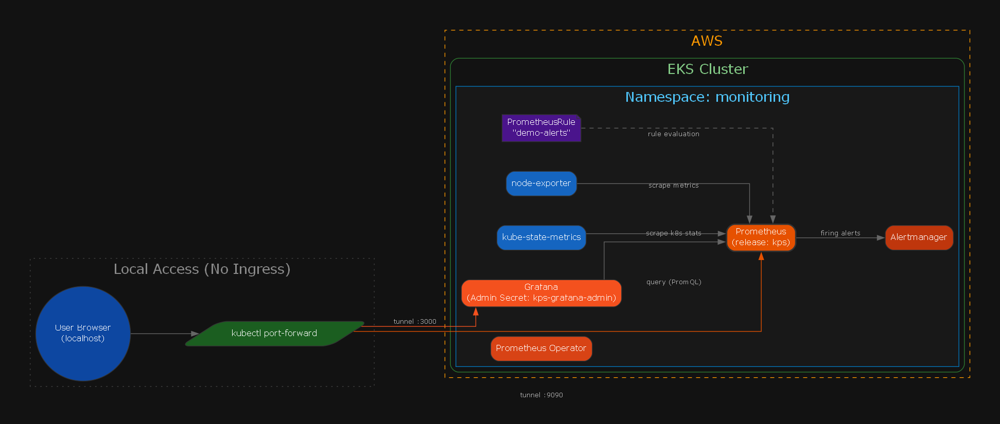

# gg-observability (P3) — kube-prometheus-stack on EKS

## 🎯 Goal
Deploy **kube-prometheus-stack** to an existing **EKS** cluster and document proof of:
- **Prometheus (metrics collector)** scraping targets
- **Grafana** access using **port-forward (local tunnel)**
- **Alerting** using a custom **PrometheusRule (Prometheus alert rules)**

## 🧭 Architecture

**PNG generated by code**
- `docs/diagrams/arch.py`

## 📦 What’s in this repo (source of truth)
- `helm/values-kps.yaml`  
  - Helm values for **kube-prometheus-stack**  
  - Release label used in repo: **kps**
- `k8s/alerts-demo.yaml`  
  - **PrometheusRule (Prometheus alert rules)** demo rules (namespace: `monitoring`)
- `docs/screenshots/`  
  - Proof screenshots (nodes, pods, Grafana, Prometheus targets, alert firing)
- `docs/runbook.md`  
  - Steps to reproduce (when you rebuild a cluster later)
- `docs/evidence.md`  
  - Claim → exact screenshot proof mapping

## ⚙️ Key config (from repo files)
From `helm/values-kps.yaml`:
- **Grafana (dashboards) Service type**: **ClusterIP (internal service)**  
- **Grafana (dashboards) admin credentials**: read from existing Secret `kps-grafana-admin`
  - keys: `admin-user`, `admin-password`
- **Prometheus (metrics collector) retention**: **12h**
- **Resource requests** (examples present in file):
  - **Alertmanager (alert router)**: `cpu: 50m`, `memory: 128Mi`
  - **Prometheus (metrics collector)**: `cpu: 150m`, `memory: 512Mi`

## 🧾 Proof
See: **`docs/evidence.md`**

## 🧹 Cleanup (when you rebuild later)
- Uninstall Helm (Helm package manager) release **kps**
- Delete namespace `monitoring` (if you created it for this project)
- Stop any port-forward (local tunnel) sessions.
